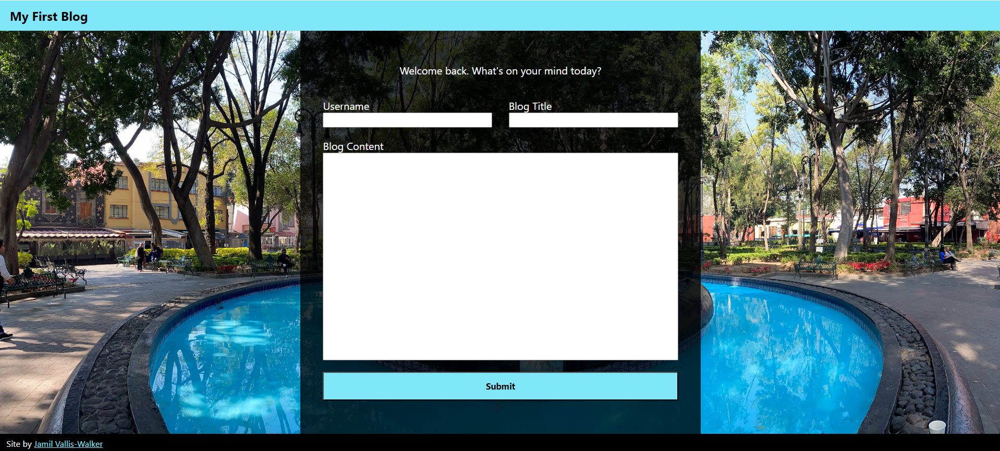

# C4-Blog
In this assignment, we were instructed to create a simple blog interface, storing posts in localStorage for later retrieval.

## Screenshot & Project Link

Project Link: https://jvalliswalker.github.io/C4-Blog/index.html

## Code References
Below are sources for code I referenced during this project.

#### Sticky Footers
* **Purpose:** Create a header and footer that do not move regarless of scroll position on the page
* **Source:** https://developer.mozilla.org/en-US/docs/Web/CSS/Layout_cookbook/Sticky_footers
* **Place(s) Used:** Styles.css, in html and body element selectors

#### Grid Template Areas
* **Purpose:** Great standardized grid areas 
* **Source:** https://www.youtube.com/watch?v=RhUuMl3R1PE
* **Place(s) Used:** `Styles.css` in `body` selector, `Forms.css` in `#form-container` Id selector

#### Sort array of objects by property value
* **Purpose:** Display blog post date chronologically
* **Source:** 
    * https://www.w3schools.com/js/js_array_sort.asp
    * https://developer.mozilla.org/en-US/docs/Web/JavaScript/Reference/Global_Objects/Array/sort
    * https://www.javascripttutorial.net/array/javascript-sort-an-array-of-objects/
* **Place(s) Used:** `blog.js` in `sortByDate()` function

#### Using data from other local JS scripts
* **Purpose:** Reduce repetition of functions/variables across js files
* **Source:** https://stackoverflow.com/questions/25962958/calling-a-javascript-function-in-another-js-file
* **Place(s) Used:** Reference variable from `logic.js` in `blog.js` function `populateExistingPostsDisplay()`, and in `form.js` function `storeBlogEntry()`

#### Scrollbar styling
* **Purpose:** Modify scrollbar appearance
* **Source:** https://developer.mozilla.org/en-US/docs/Web/CSS/CSS_scrollbars_styling
* **Place(s) Used:** `styles.css`, in `dark-scrollbar` and `light-scrollbar` classes
